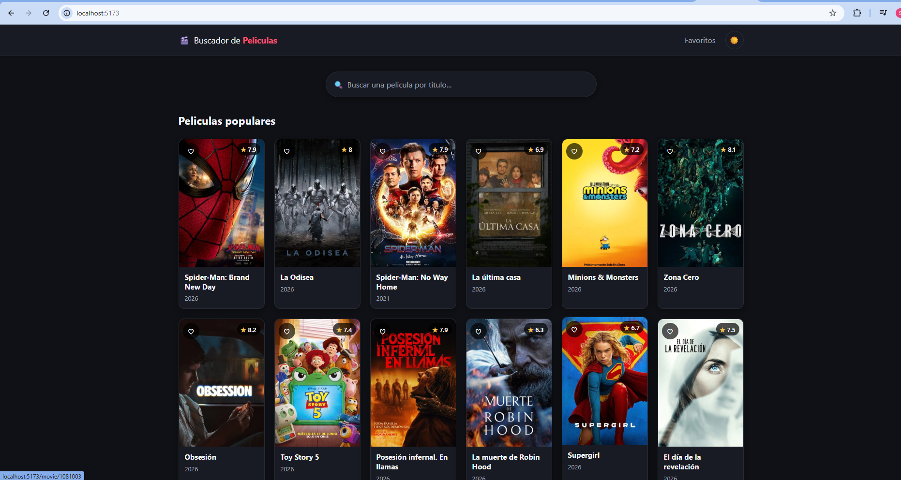
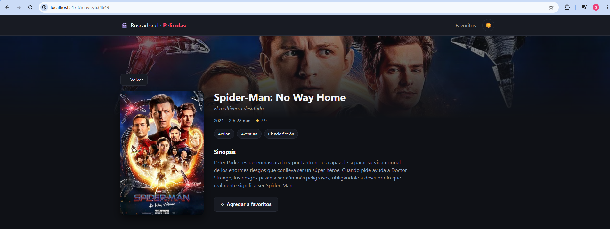
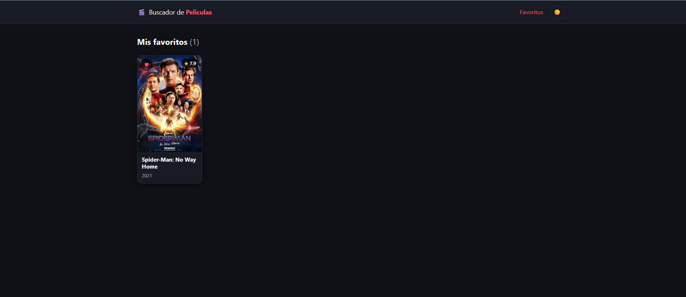

# 🎬 Buscador de Películas

Buscá películas, mirá su ficha completa y guardá tus favoritas.
Hecho con **React + Vite**, con datos de la API de [TMDB](https://www.themoviedb.org/).

🔗 **Demo:** _(pegar acá la URL de Vercel una vez publicado)_

## Por qué lo hice

Salí del cine de ver *La Odisea* y *Spider-Man*, y me quedé con ganas de armar
algo con películas. Además quería practicar React + Vite en serio, porque no
tenía idea: sabía la teoría de un curso, pero nunca había hecho un proyecto
propio de punta a punta. Este es ese proyecto.

## Qué hace

- Buscador con **debounce**: espera a que dejes de escribir antes de consultar
  la API, en vez de disparar una petición por cada tecla.
- Películas populares al entrar, ficha de detalle con sinopsis, año, duración,
  géneros y puntaje.
- **Favoritos** guardados en el navegador: sobreviven al refresh.
- **Tema claro/oscuro**, que arranca respetando el del sistema.
- Estados de carga, error (con botón para reintentar) y búsqueda sin resultados.
- Responsive, de 360 px hasta escritorio.

## Stack

React 19 · Vite 8 · React Router 7 · CSS Modules · API de TMDB

Sin librerías de estado ni de UI: para una app de este tamaño, `useState` y
`useContext` alcanzan.

## Cómo correrlo

```bash
git clone https://github.com/SantiagoFrancoOrt/buscador-peliculas.git
cd buscador-peliculas
npm install

# Copiar .env.example como .env y pegar la API key de TMDB
# (se saca gratis en https://www.themoviedb.org/settings/api)

npm run dev
```

## Cómo está organizado

```
src/
├─ api/tmdb.js       # única capa que habla con TMDB
├─ hooks/            # useDebounce, useMovies, useMovie, useFavorites, useTheme
├─ context/          # estado global de favoritos
├─ components/       # piezas reutilizables, cada una con su CSS Module
├─ pages/            # Home, MovieDetail, Favorites, NotFound
└─ styles/           # reset y variables CSS del tema
```

La regla que ordena todo: **ningún componente hace `fetch`**. Las peticiones
viven en `api/tmdb.js`, los hooks manejan los estados y los componentes solo
pintan.

## Como se ve la pagina
---





 